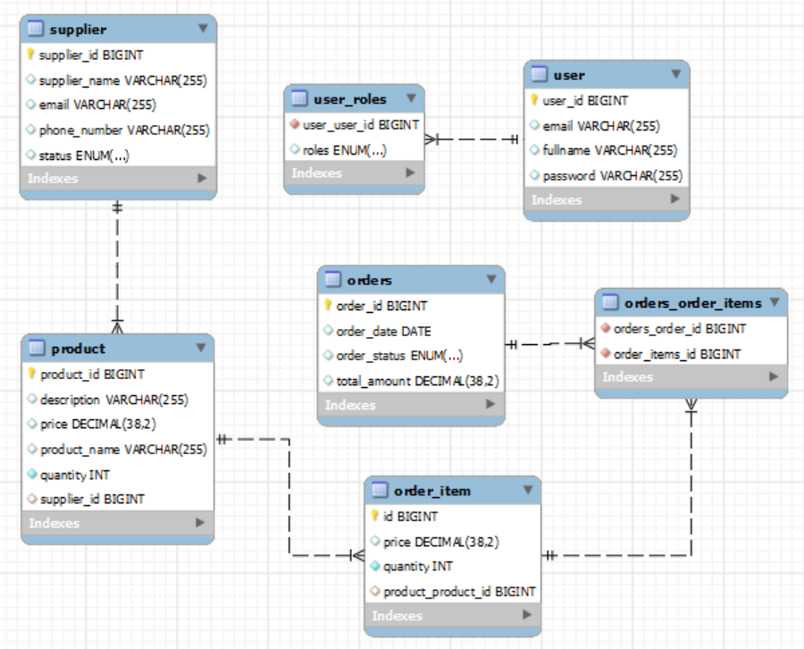
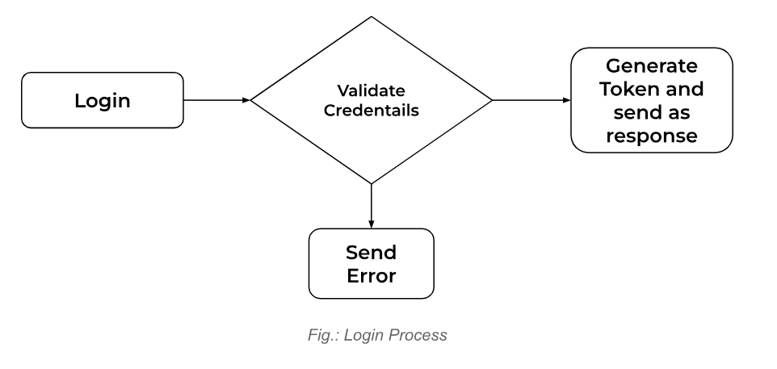
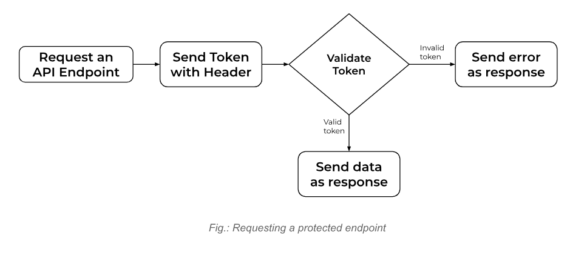

# **Project Overview**

Inventory Management System is a platform that aims to track products in user’s stack and get updated about the orders
they receive. It provides a comprehensive solution to managing products, suppliers, and orders. This Inventory
Management System enables users to track product availability, manage suppliers, and process orders.

## **Features**

* User authentication and authorization with JWT.
* Manage products, suppliers, and orders.
* Role-Based Access Control
* Import and Export product data in CSV format.
* Error handling

## **Scope**

This project will focus on developing a backend only inventory management system with RESTful APIs, utilizing Spring
Boot and Hibernate for database interactions. The system will not include a user interface; instead, it will be tested
and validated using Postman to ensure API functionality and reliability.

The core functionalities includes:

* User Management
* CRUD operations for products, suppliers, and orders.
* User authentication and authorization using JWT.
* Data import and export functionalities for products and orders in CSV format.
* Implementation of various relationships to model the database schema.

# **Technical Requirements**

## **Tech Stack**

* **Programming Language**: Java
* **Framework**: Spring Boot
* **Database**: MySQL
* **ORM**: Hibernate
* **Security**: Spring Security for authentication and authorization
* **JSON Web Tokens (JWT)**: For secure token-based authentication
* **CSV Processing**: Apache Commons CSV or similar library for handling CSV import/export
* **Testing**: JUnit and Mockito for unit and integration testing

## **Testing Requirements**

* Unit tests will be implemented for service and controller layers to ensure the correctness of business logics.
* Postman will be used for manual testing of APIs, ensuring each endpoint works as expected under various conditions.

# **Functional Requirement**

## **User management**

### **User Registration**

* Users can register by providing a unique email and password.
* Roles will be assigned during registration, defaulting to USER.
* Existing ADMIN can register other ADMIN.

  ### **User Login**

* Users can log in using their credentials (username and password).
* Upon successful login, a JWT will be generated and returned for authenticated requests.

  ### **Role-Based Access Control**

* **ADMIN**:
    * Can create, read, update, and delete products, suppliers, and orders.
    * Can upgrade user roles.
* **USER**:
    * Can read product information.
    * Can create, read, and delete their own orders.

## **Product Management**

* Multiple products have one supplier associated with it.
* An ADMIN can perform CRUD operations on the products such as adding quantities, deleting products, etc.

## **Supplier Management**

* One supplier can have multiple products.
* Admin can change(edit) the suppliers of products.
* Admin can add new suppliers to the system.

## **Order Management**

* Each order can include multiple products, with the ability to specify quantities for each product.
* The total amount depends on the selected products and their quantities.
* An ADMIN can perform CRUD operations on the orders such as changing status, invalidating order, etc.

## **CSV Import/Export**

### **Export Functionality**

* An Admin can export the list of products and orders as CSV files.
* The format of CSV files will be:
    * **Product CSV**: `id, name, description, price, quantity, supplierName`
    * **Order CSV**: `id, orderDate, status, totalAmount, products`

  ### **Import Functionality**

* Admin can import products and orders from CSV files. Format should be the same as mentioned above.
* The system will validate the data and return errors for any invalid records.

#   

# **System Architecture**

## **ER Diagram**

## **JWT Authentication**

# **API Design**

The system will have following API endpoints:

* `[POST] /api/auth/login`  
  Accepts login credentials {`email`, `password`}, validates against the database record, and then returns JWT token with
  HTTP Status `OK` in case of valid credentials. If invalid, HTTP Status `UNAUTHORIZED 401` is sent.

* `[POST] /api/auth/signup`  
  Accepts a user’s details {`fullname`, `email`, `password`, `roles`} from an Admin user. If the same email doesn’t exist, it saves the credentials with HTTP status `CREATED(201)`. Else `
  DuplicateRecordException` is thrown with HTTP status `INTERNAL SERVER ERROR (500)`

  ---

* `[GET] /api/secure/product/all`  
  Fetches a list of products from the database.

* `[POST] /api/secure/product/new`  
  Accepts a product’s details {`productName`, `description`, `price`, `quantity`, `supplierId`}. If the provided supplier exists
  the data is saved, else the operation fails. Upon successful operation, the saved data is returned with HTTP status
  `CREATED(201)`.

* `[GET] /api/secure/product/{id}`  
  Gets the product’s details {`productId`, `productName`, `description`, `price`, `quantity`, `supplierName`} from the database for
  the matched id. If product doesn’t exist,

* `[PUT] /api/secure/product/update/{productId}`  
  Accepts a new set of data about a product as request body and productId as path variable. If the product exists, old
  information is replaced with new one and Http Status 201 is returned. Else, the `NotFoundException` is thrown.

* `[DELETE] /api/secure/product/delete/{productId}`    
  Takes productId as path variable. If the product exists, it is removed in the database. Else, `NotFoundException` is
  thrown.

* `[PUT] /api/secure/product/restock/{productId}`    
  This endpoint re-stocks the quantity of products available in the inventory.

  ---

* `[GET] /api/secure/suppliers`  
  Fetches a list of suppliers both active and inactive from the database.

* `[POST] /api/secure/suppliers/new`  
  Accepts a supplier’s details {`supplierName`, `email`, `phoneNumber`, `status`} and saves to the database. Then, the detail
  saved is returned with HTTP status CREATED(201).

* `[PUT] /api/secure/supplier/update/{supplierId}`  
  Accepts a new set of data about a supplier as request body and supplier’s id as path variable. If the supplier exists,
  old information is replaced with new one with Http Status 201\. Else, the `NotFoundException` is thrown.

* `[GET] /api/secure/supplier/changeStatus/{supplierId}`    
  An Admin can change a supplier’s status from Active to Inactive and vice versa. For this, new status will have to be
  supplied as a Query Parameter. If the supplier doesn’t exist, then `NotFoundException` is thrown.

* `[GET] /api/secure/supplier/products`    
  Any user logged into the system can see what products the supplier has in the system. The supplier’s id has to be
  provided as a body parameter. It returns an object {`productName`, `price`, `supplierName`}.

  ---

* `[GET] /api/secure/orders/all`  
  Fetches a list of all the orders both active and inactive from the database along with items, quantities, product
  name.

* `[POST] /api/secure/orders/new`  
  This creates a new order and saves it to the database. Each order comprises an Order entity and OrderItem entity.
  OrderItem is responsible for storing products with quantity while Order entity holds other information such as
  totalAmount, orderStatus, orderDate. If the order is created successfully, an HTTP status `CREATED(201)` is sent.
  Otherwise, other relevant status such as `BAD REQUEST` or `INTERNAL SERVER ERROR` is sent.

* `[PUT] /api/secure/orders/update/{orderId}`  
  This endpoint is responsible for editing an order, especially its items. It allows addition of new items or editing
  quantities of existing items in a specific order which is tracked by its ID. If new products (by id) do not exist or
  their quantities are more than that of what is available, `BAD REQUEST` status is sent halting the process. If
  everything is valid and available, record(s) are updated and status `OK` is sent.

* `[DELETE] /api/secure/orders/delete/{orderId}`    
  This endpoint deletes an order. If the order doesn’t exist, status `BAD REQUEST` is sent.

---

* `[POST] /api/secure/product/import`  
  This endpoint allows authorized users to import products into the system. The request body must contain a list of
  product data, including attributes such as {`productName`, `description`, `price`, `quantity`, and `supplierId`}. Any
  user with authorities `ADMIN` or `EMPLOYEE` can perform the import.

* `[GET] /api/secure/product/export`  
  This endpoint allows authorized users to export the list of products in the system to a CSV file. The system generates
  a CSV file containing product details such as {`productId`, `productName`, `description`, `price`, `quantity`, and
  `supplierName`}, and returns the file as a downloadable attachment.

  ---

* `[POST] /api/secure/supplier/import`  
  This endpoint allows authorized users to import suppliers into the system. The request body must contain a list of
  supplier data attributes such as {`supplierName`, `email, phoneNumber`, and `status`}. Any user with authorities
  `ADMIN, EMPLOYEE` can perform the import.

* `[GET] /api/secure/supplier/export`  
  This endpoint allows authorized users to export the list of suppliers in the system to a CSV file. The system
  generates a CSV file containing supplier details such as {`Id`, `supplierName`, `email`, `phoneNumber`, and `status`},
  and returns the file as a downloadable attachment.

  ---

* `[POST] /api/secure/orders/import`  
  This endpoint allows authorized users to import orders into the system. The request body must contain a list of order
  data with following attributes {`order_id`, `order_date`, `order_status`, `total_amount`, `product_id`, `price`, and
  `product_quantity`}. Any user with authorities `ADMIN, EMPLOYEE` can perform the import.

* `[GET] /api/secure/orders/export`  
  This endpoint allows authorized users to export the list of orders in the system to a CSV file. The system generates a
  CSV file containing order details such as {`Id`, `supplierName`, `email`, `phoneNumber`, and `status`}, and returns
  the file as a downloadable attachment.

